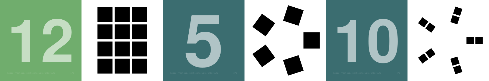

# countdot.hs



These are some cards students can use to practice
[subitizing](https://en.wikipedia.org/wiki/Subitizing) and counting by
grouping.  Students could play a game like
[war](https://en.wikipedia.org/wiki/War_(card_game)) using these
cards.

## Where to purchase?

You can purchase a set of cards from 
[makeplayingcards.com](https://www.makeplayingcards.com/sell/marketplace/countdot.html) using a [collection of dot patterns](https://github.com/kisonecat/countdot.hs/blob/main/app/Main.hs#L18-L89).


## Algebra for dot patterns 

These patterns of dots are built using some "algebraic" notation, specifically

```
data DotPattern =
  Grid Integer Integer |
  Ring Integer |
  DotPattern :* DotPattern |
  DotPattern :- Integer
```

For example, to create a grid, you could use `Grid 3 4` which would produce


For example, to place dots in a circle, you could use `Grid 5` which would produce


The interesting thing about `DotPattern`s is that you can combnie these with "algebraic" operators like `:*` to "multiply" two dot patterns, e.g., `Grid 2 2 :* Ring 3` produces


which is a 2-by-2 grid with each of those four spots containing a circle of three dots.

Another example is `Ring 5 :* Grid 2 1`,


There is also a subtraction operator `:-` which takes away some number of dots.
For example, `(Ring 5 :- 1) :* Grid 2 1` starts with a circle of five dots, removes one using `:- 1`, and then replaces each of those dots with a 2-by-1 grid.


If we had instead chosen to use `Ring 5 :* Grid 2 1 :- 1`, we would have again started with five dots, replaced each of those dots with a 2-by-1 grid, and *then* we removed one dot with `:- 1`.


## Generating the cards

To produce the `front000.tiff` and `back000.tiff` files:

```
nix-shell
cabal build
cabal run
mutool draw -r 1200 -o front%03d.tiff front.pdf
mutool draw -r 1200 -o back%03d.tiff back.pdf
```
